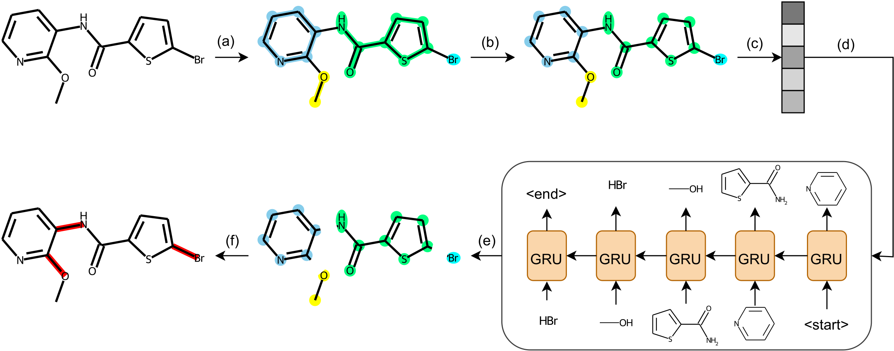
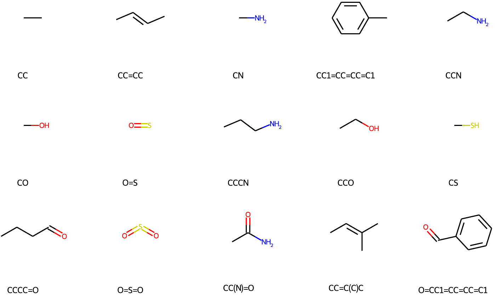
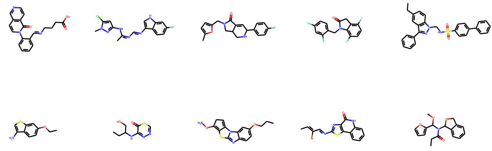

# PS-VAE: Molecule Generation by Principal Subgraph Mining and Assembling

This repo contains the codes for our paper [Molecule Generation by Principal Subgraph Mining and Assembling](https://arxiv.org/abs/2106.15098) accepted by NeurIPS 2022. We have also written a [blog](https://kxz18.github.io/2022/09/26/PSVAE/) to illustrate our paper in more details.

if you use the code, please cite the following paper:

```
@article{kong2021molecule,
    title={Molecule Generation by Principal Subgraph Mining and Assembling},
    author={Kong, Xiangzhe and Huang, Wenbing and Tan, Zhixing and Liu, Yang},
    journal={Advances in neural information processing systems},
    year={2022}
}
```

## Quick Links

- [Introduction](#introduction)
- [Codes](#codes)
    - [End-to-end Framework](#end-to-end-framework)
    - [Principal Subgraph Extraction](#principal-subgraph-extraction)
- [Examples](#examples)
- [Contact](#contact)

## Introduction

Our proposed method contains two parts: principal subgraphs extraction and VAE-based two-step subgraph generation & assembly.

Generally speaking, the concept of principal subgraph (PS) and its extraction algorithm make it possible to mine the frequent subgraphs that reflects the atom combination pattern of a given dataset efficiently. As validated in our paper, compared to hand-crafted or rule-based vocabularies, using PS-based vocabulary improves subgraph-level molecule generation methods significantly because these subgraphs not only capture the general pattern in molecules, but also their correlations with the molecular properties.

The two-step generation framework first generates subgraphs in a sequential manner by treating each type of the subgraph as a discrete token in the vocabulary. Then we union the generated subgraphs as a disconnected molecular graph for message passing and globally predict the connections between each these subgraphs.

Below is the overall diagram of our method:



## Codes
###  End-to-end Framework

The directory [*src*](src) contains the complete codes of the principal subgraph extraction algorithm, our principal subgraph variational autoencoder (PS-VAE) and the checkpoints / data used in our experiments. If you are interested in training a PS-VAE on your own dataset or running some experiments on PS-VAE, please refer to the instructions provided in that directory.


### Principal Subgraph Extraction

We have also provided a polished version of the principal subgraph extraction algorithm decoupled with other codes in the directory [*ps*](ps), which we recommend you to use *if you are only interested in the extracted principal subgraphs as well as the subgraph-level decomposition of molecules*. Please refer to that directory for detailed instructions.


## Examples

Here are examples of extracted principal subgraphs on the ZINC250K dataset:



We provide examples of molecules generated by our PS-VAE as well:




## Contact
Thank you for your interest in our work!

Please feel free to ask about any questions about the algorithms, codes, as well as problems encountered in running them so that we can make it clearer and better. You can either create an issue in the github repo or contact us at jackie_kxz@outlook.com.
